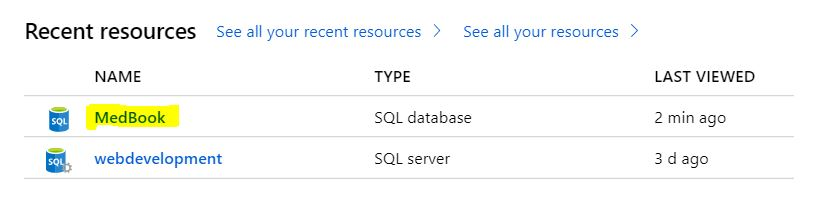
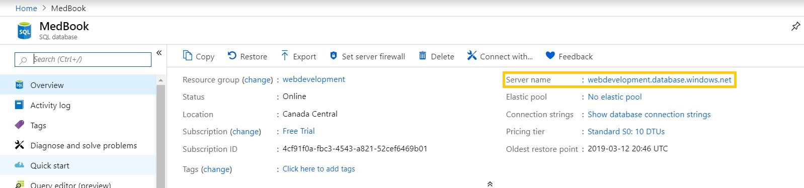
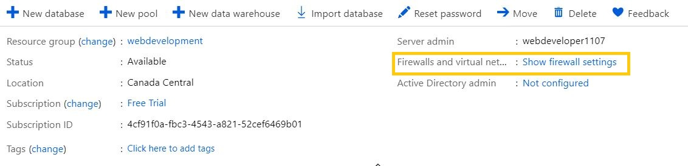
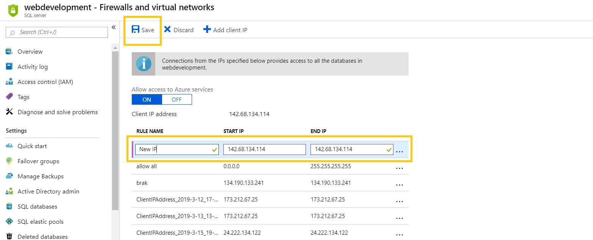
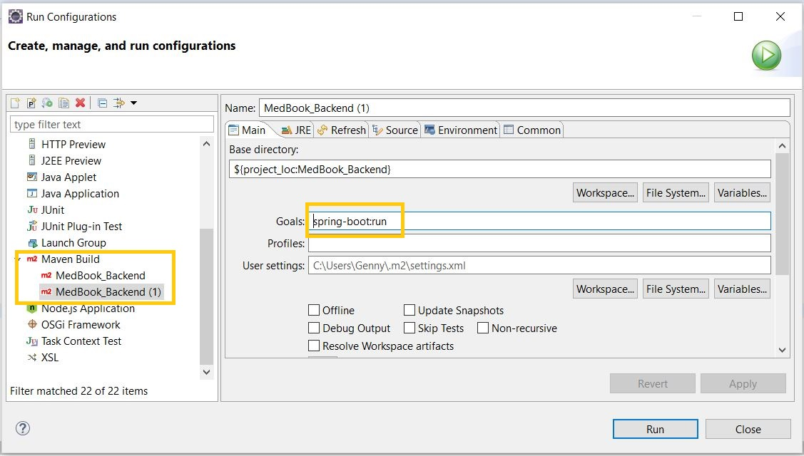
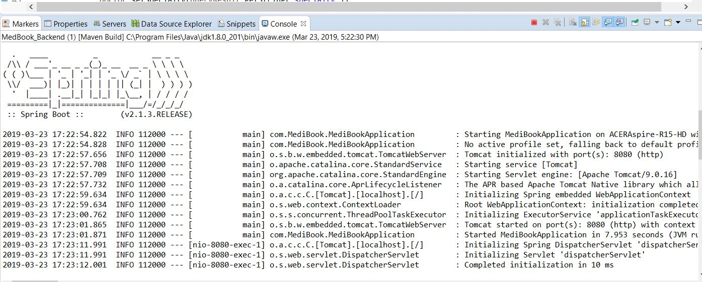

# Medbooking

**Group 11**

This file contains the instructions to execute the different parts that compose 
Medbooking.

Medbooking is developed using the following technologies:
* Frontend: Angular7
* Backend: Spring Boot
* Database: SQL on [Microsoft Azure](https://portal.azure.com).

## Demo 
If you wish to use users with existing information, these are the sample users:
* Doctor:
  * Username: jojones@email.com
  * Password: hello1234
* Patient:
  * Username: gennyc@mail.com
  * Password: hola1234

## Installation
### Database
We have provided public access through requests, but if it fails, in order to access to the database, first you need to log into [Microsoft Azure](https://portal.azure.com)
with the following credentials:
* username: webdeveloper1107@gmail.com
* password: Password@456.

After login, it should show you the home page. On **Recent resources**, select _Medbooking_.

Then, click on the server name.

Look for **Firewall**. Click on "Show firewall settings".

Once you're inside the firewall settings, add your IP Address and Save your changes.
It should take about 5 minutes for your IP Address to be accepted.

### Backend

The backend is developed in Java using Spring Boot framework. The team
is using Eclipse IDE to develop and run the project. In order to run the project,
follow these instructions:

 1. Download the zip from Brightspace or clone the repository from Gitlab.
 2. Open the project in Eclipse IDE. The folder should be Medbook_Backend.
 3. Go to Run>Run configurations.
 4. Select Maven Build and in Goals write `spring-boot:run`.
 
 5. Now you can run the project. You should see something like in the picture below.
 The server url is `http://localhost:8080/`.
 

### Frontend

1. Open your command line (assuming you have installed node and angular cli).
2. Navigate to the project folder ex. C:/your_path/Medbook where you have stored/cloned 
the project.
3. Run npm install.
4. Run `ng serve`. Navigate to `http://localhost:4200/`. The app will automatically reload if you change any of the source files.

## Implementation

* The team created common bases for Frontend and Backend. Assignment 4 has been
built based on these code bases.

* All the information showed in the feature is taken directly from the database.

* Although there are link references throughout the code, I'll explain some of the
snippets or problems faced in either backend of frontend.
The references sections will include some other references used for bug fixing 
or components implementation.

* Overall, I procured to use meaning full naming for parameters and functions. I have
also included comments and method descriptions along.

* Regarding the responsiveness, I tried to cover as much as I could using the
developer tools for sizing by Chrome and other browsers.

* Regarding the folder structure and W3C validation, Angular provides its own folder
structure and throws a lot of errors with W3C validation since it uses its own
tags. On the backend side, there's also certain structure to be followed to use
Spring boot. Therefore, the requested folder structure could not be achieved.

### Frontend
As mentioned before, the frontend is implement in Angular. As a start point, I
used [this tutorial](https://www.devglan.com/angular/angular-7-crud-example ) 
as reference on how components interact with each other. The same tutorial was
also useful to understand the interactions with the backend.

The validation for fields such as in the search main page was performed using
angular elements such as ElementReferences, ngIf, etc. 

The implementation of Google Maps API was quite different from the first implementation
I worked in on my A2 where I was just using HTML. For Angular, you have to install
some modules in order to be able to access to geocoding and autocomplete functions.
I took guidance from [this](https://stackoverflow.com/questions/53894400/angular-7-use-import-googlemaps 
), [this](https://stackoverflow.com/questions/51084724/types-googlemaps-index-d-ts-is-not-a-module 
) post from StackOverflow and 
[Reverse Geocoding Google documentation](https://developers.google.com/maps/documentation/javascript/geocoding#ReverseGeocoding).

It had been a long time since I worked with Angular, so I relied a lot on its
[documentation](https://angular.io/api).

Even though there was code taken from external sources, most of it was modified
to fit the project's needs regarding the information that needed to be shown or
retrieved. 

The doctor's profile images are stored under assets for the moment. Other member's
implementation might change this.

### Backend
A big part of my feature was based on Geolocation. I found a solution
[here](•http://janmatuschek.de/LatitudeLongitudeBoundingCoordinates) and then
modified it to work with the parameters used on our database. The main Geolocation
class remained unmodified as referred in the class itself in the code.

Also, I had trouble with Cross origin requests but got the correct and needed notation 
from [Spring documentation](https://docs.spring.io/spring/docs/current/spring-framework-reference/web.html#mvc-cors 
).

### Database

I did struggle with the database because for some reason, Azure does not
accept all of the SQL commands available. For example, I had trouble doing 
autoincrement fields in Azure. After long and further research, one of the
solutions presented [here](https://stackoverflow.com/questions/19002101/how-to-make-auto-increment-of-an-existing-primary-key-in-azure 
) worked for me.
  	
Additionally, I got the following error from the backend:

`Client with IP address '142.68.134.114' is not allowed to access the server.  
To enable access, use the Windows Azure Management Portal or run 
sp_set_firewall_rule on the master database to create a firewall rule for 
this IP address or address range.  It may take up to five minutes for this 
change to take effect.` 

The [solution](https://dzone.com/articles/azure-powertip-4-unable-to-connect-to-azure-sql-da )
was to access to Azure firewall and add my IP address.

## References

 1. Assignment 2, Genny Centeno, B00726801
 2. Assignment 3, Genny Centeno, B00726801
 3. Advanced Web Development Lab 2 Slides, Web Lab Teacher Assistants.
 4. Group 11 assignments.
 
 **Angular**
 1. https://angular.io/api/common/NgIf
 2. https://stackoverflow.com/questions/35039610/manually-set-value-for-formbuilder-control
 3. https://stackoverflow.com/questions/47551458/how-to-pass-urlsearchparams-in-the-httpclient-get-method-angular-5?rq=1 

**SQL**
1. https://dev.mysql.com/doc/refman/8.0/en/create-table.html
2. https://www.w3schools.com/php/php_mysql_create_table.asp
3. http://www.mysqltutorial.org/

* Other references are presented as links in this readme file.
* **References to links of code snippets used as is or as foundation for the code,
are also included as comments in the html, js and css code.**

